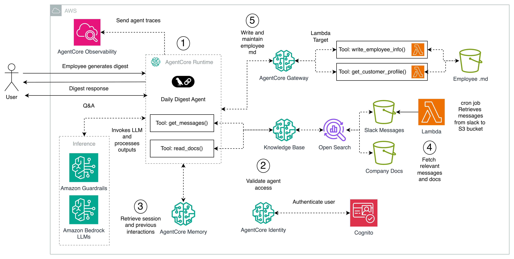

# EverCurrent Daily Digest Tool

## Overview

The **EverCurrent Daily Digest Tool** is an intelligent agentic solution designed to assist robotics hardware engineering teams (mechanical, electrical, supply chain, etc.) by mitigating knowledge silos caused by high-volume Slack communication.

Instead of a generic news feed, the system generates **personalized digests** that adapt to each user's changing priorities, role, and project phases. By surfacing targeted information, it aims to align teams on execution and reduce information overload.

## High-Level Architecture

The system is built on **AWS** and deployed using the **AgentCore Runtime**. It operates as a **LangChain agent** that orchestrates information retrieval, user profiling, and safety checks to generate digests.

**Core Architecture Components:**
*   **Runtime:** AgentCore Runtime (hosts the Daily Digest Agent).
*   **Inference:** Amazon Bedrock LLMs provide the reasoning backbone.
*   **Knowledge Base:** Amazon OpenSearch and Amazon Bedrock Knowledge Base serve as retrieval engines.
*   **Identity:** Amazon Cognito handles user authentication.
*   **Observability:** AgentCore Observability captures agent traces.

## Core Components

### 1. AgentCore Runtime & Daily Digest Agent
The central orchestration engine. It hosts the Daily Digest Agent, managing session initialization, state, and the cognitive **ReAct (Reasoning + Acting)** loop.
*   **Function:** Analyzes user requests and iteratively calls tools (`get_messages`, `read_docs`, `get_customer_profile`) to construct answers.
*   **Design Choice:** Prioritizes **accuracy over speed** by allowing the agent to reason iteratively, reducing hallucinations at the cost of higher latency compared to simple RAG chains.

### 2. AgentCore Gateway (Dynamic Profiling Engine)
A specialized gateway that manages dynamic user contexts using **sub-agents** and unstructured storage.
*   **`write_employee_info()`**: Extracts implicit signals from user interactions (e.g., shifting focus from "battery thermal management" to "logistics") and updates an `Employee.md` file in S3.
*   **`get_customer_profile()`**: Reads the `Employee.md` file to inject specific user persona context (role, focus) into the main agent's prompt.
*   **Trade-off:** Uses Markdown files instead of a SQL database to allow for flexible, natural language profiling, accepting higher query latency for greater nuance.

### 3. Data Ingestion Pipeline (The Knowledge Backbone)
An asynchronous **Extract, Load, Index (ELI)** pipeline ensures the knowledge base is current.
*   **Sources:** Slack Workspaces and Company Documentation.
*   **Process:** A Lambda Cron Job fetches data, dumps raw JSON/Text to S3, and triggers Amazon Bedrock to chunk, embed, and index the content into **Amazon OpenSearch**.
*   **Freshness:** Operates on eventual consistency to maintain architectural simplicity and cost efficiency.

### 4. Retrieval & Inference Layer
*   **Retrieval:** **Amazon OpenSearch** (Vector Database) performs semantic search to find relevant Slack threads and docs.
*   **Inference:** **Amazon Bedrock LLMs** generate the final response using the retrieved context and user profile.

### 5. Safety & Governance
*   **Amazon Guardrails:** A post-inference layer that scans generated text for PII, toxicity, and hallucinations before the response reaches the user.

## Data Flow

The system follows a strict lifecycle for every request:

1.  **Asynchronous Ingestion:** Continuous aggregation of knowledge from Slack and Docs into Amazon S3 and OpenSearch.
2.  **Authentication:** User identity is verified via **Amazon Cognito** and AgentCore Identity.
3.  **Personalization (AgentCore Gateway):**
    *   The agent calls `get_customer_profile()`.
    *   The Gateway fetches the user's `Employee.md` from S3.
    *   Specific context (e.g., "Mechanical Engineer focusing on Actuators") is returned to the agent.
4.  **Query Execution:**
    *   The agent invokes `get_messages()` and `read_docs()` to query the Bedrock Knowledge Base.
    *   **Amazon Bedrock LLMs** generate the digest based on the user's profile and retrieved data.
5.  **Profile Evolution:** If the interaction reveals new priorities, the `write_employee_info()` sub-agent updates the user's profile in S3, ensuring the system learns over time.
6.  **Observability:** All traces and tool outputs are emitted to AgentCore Observability.

---
*For more detailed information, please refer to the documentation in the `docs/` directory.*
